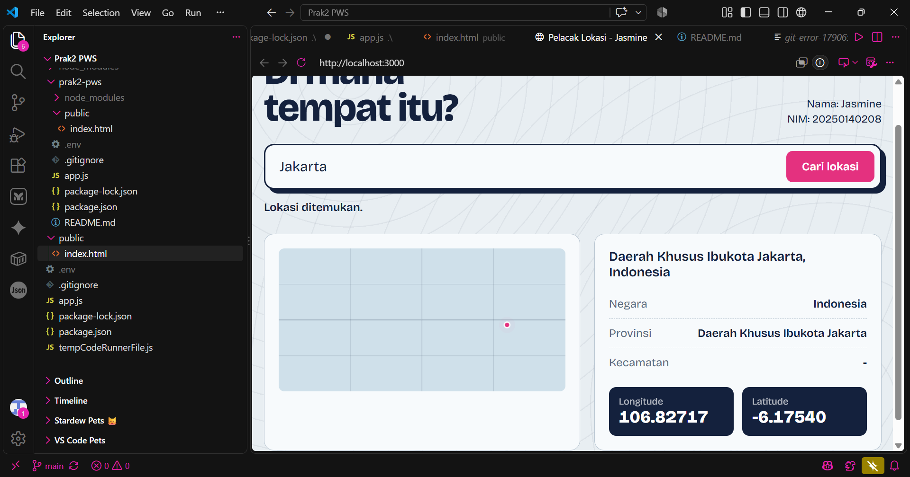

Praktikum 2 PWS - Pencari Lokasi (MapTiler Geocoding API)

Nama: Jasmine
NIM: 20250140208

Aplikasi web sederhana (Node.js + Express + HTML) untuk mencari lokasi di Indonesia dan menampilkan negara, provinsi, kecamatan, longitude, dan latitude dari MapTiler Geocoding API.

Fitur:
Input lokasi bebas (kota, kabupaten, kecamatan, atau nama tempat di seluruh Indonesia)
Menampilkan negara, provinsi, kecamatan, longitude, dan latitude
Posisi lokasi ditandai dengan pin di peta dunia mini
API key disimpan di server (.env), tidak terlihat di browser
Teknologi

Node.js, Express, Axios, dotenv, HTML/CSS/JavaScript, MapTiler Geocoding API

Cara menjalankan: 
Jalankan npm install
Salin .env.example menjadi .env, lalu isi MAPTILER_API_KEY dengan API key MapTiler
Jalankan npm run dev (lokal, pakai nodemon) atau npm start
Buka http://localhost:3000 di browser
Endpoint

GET /api/lokasi?q=<nama lokasi>

Pencarian dibatasi untuk wilayah Indonesia (country=id).

Contoh:

http://localhost:3000/api/lokasi?q=Kasihan
http://localhost:3000/api/lokasi?q=Jayapura
http://localhost:3000/api/lokasi?q=Sabang

Data mentah dari MapTiler dapat dilihat dengan menambahkan &debug=1.

Screenshoot:
